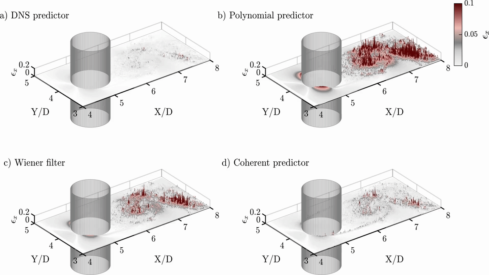
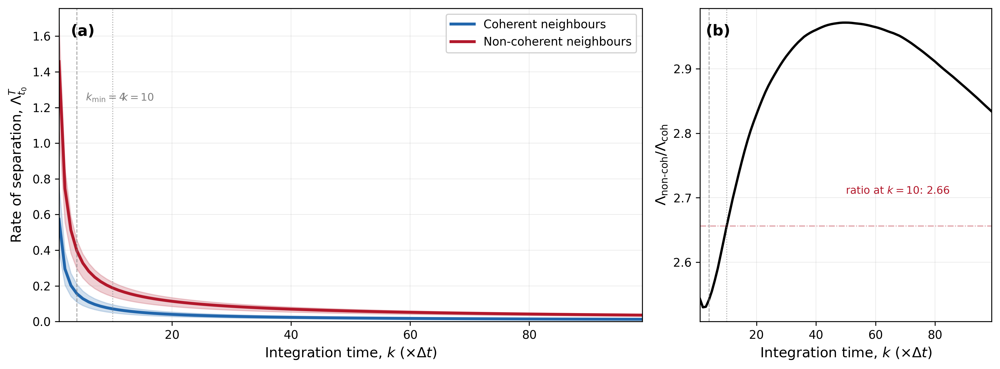
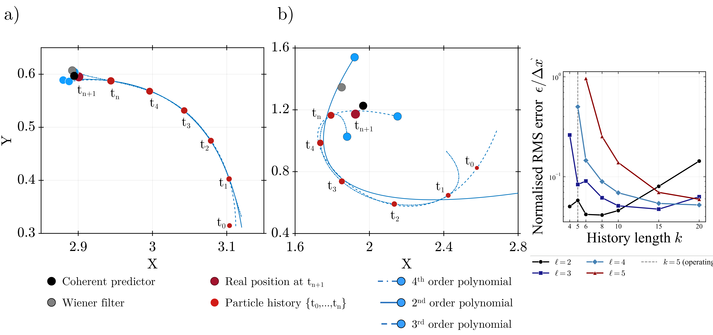
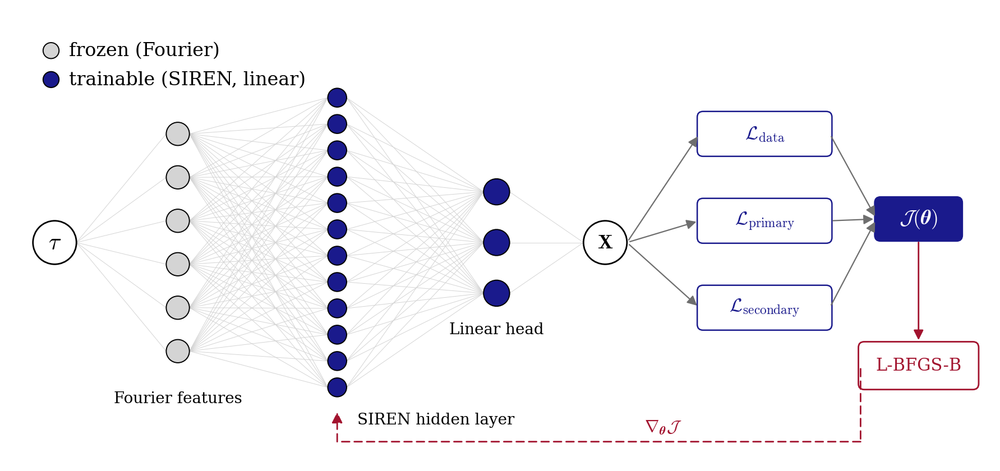
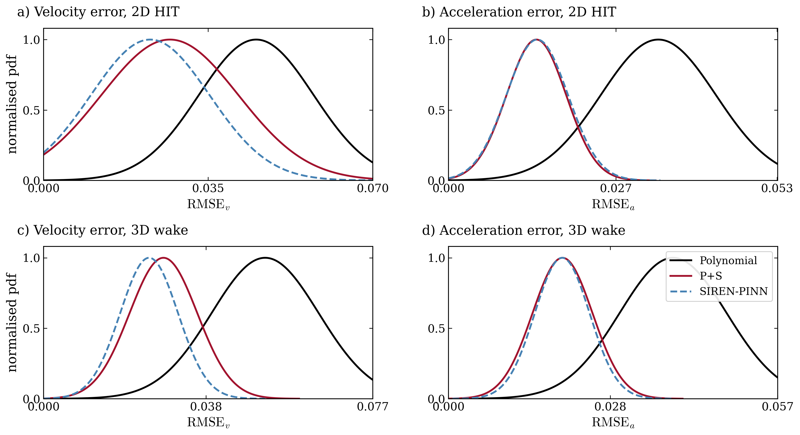

# Coherent motions to predict Lagrangian trajectories

<p align="center">
  
</p>

<p align="center">
  <em>Supplementary Movie 1. Instantaneous position estimation error
  averaged in the z direction: (a) DNS predictor, (b) Polynomial predictor,
  (c) Wiener filter, (d) Coherent predictor. The Coherent predictor
  (panel d) narrows and dims the error field relative to the polynomial
  and Wiener baselines over time.
  <br/>Higher resolution MP4:
  <a href="docs/figures/supplementary_movie_1.mp4">supplementary_movie_1.mp4</a></em>
</p>

<p align="center">
  
</p>

Companion code for the preprint

> Rahimi Khojasteh, A. et al. *Coherent motions to predict Lagrangian
> trajectories*. arXiv preprint, 2026. Under review at the Journal of Fluid
> Mechanics. <https://arxiv.org/abs/2508.21191>

The package implements three predictors compared in the paper:

1. **Polynomial** baseline (Novara and Scarano style polynomial extrapolation)
2. **Primary coherent (P)** — polynomial plus velocity and acceleration
   constraints built from FTLE filtered coherent neighbours at the last
   history snapshot
3. **Primary plus Secondary (P+S)** — P augmented with phase delayed
   constraints at the target snapshot, drawn from the non coherent pool

An Appendix C module also ships a tiny SIREN plus Fourier feature PINN
(physics informed neural network) that reuses the same collocation targets
inside a differentiable neural field.

<p align="center">
  
</p>

<p align="center">
  <em>Headline result. Error reduction of Primary (P) and Primary+Secondary
  (P+S) coherent predictors over the Polynomial baseline on 2D HIT DNS with
  10% positional noise. P+S improves both velocity and acceleration
  predictions; the lift is strongest on acceleration where the FD signal
  to noise ratio is ~0.17.</em>
</p>

---

## Quick start

### Option A — Google Colab (recommended)

Open any notebook directly in the browser, no local install needed. Each
notebook starts with a cell that installs the package, clones the DNS data,
and runs end to end on a CPU kernel.

| Notebook | What it does | Colab |
|---|---|---|
| `01_core_predictor.ipynb` | Polynomial vs P vs P+S on 2D HIT DNS, publication figure and summary table | [Open in Colab](https://colab.research.google.com/github/AliRKhojasteh/coherent-predictor/blob/main/notebooks/01_core_predictor.ipynb) |
| `02_siren_pinn.ipynb` | Appendix C. SIREN+Fourier PINN v7i-d on 2D HIT and 3D wake | [Open in Colab](https://colab.research.google.com/github/AliRKhojasteh/coherent-predictor/blob/main/notebooks/02_siren_pinn.ipynb) |
| `03_ftle_evaluation.ipynb` | Integration time sweep, coherent fraction vs T, alpha optimisation | [Open in Colab](https://colab.research.google.com/github/AliRKhojasteh/coherent-predictor/blob/main/notebooks/03_ftle_evaluation.ipynb) |

Replace `AliRKhojasteh` with the GitHub owner once the repository is pushed.

### Option B — Local install

```bash
git clone https://github.com/AliRKhojasteh/coherent-predictor.git
cd coherent-predictor
pip install -e ".[pinn]"
```

The `pinn` extra pulls in `autograd`, which is only needed for the SIREN
notebook. Core predictor and FTLE modules work without it.

---

## A 20 line example

```python
import numpy as np
from coherent_predictor import (
    load_trajectories, add_positional_noise, median_nn_distance,
    compute_fd, compute_smoothed,
    PredictorConfig, predict_one_particle,
)
from sklearn.neighbors import KDTree

P      = load_trajectories("1_10000_dt10_comparison.mat", dims=2)
P_n, _ = add_positional_noise(P, noise_fraction=0.10)
V, A   = compute_fd(P, dt=10.0)              # clean ground truth
V_n, _ = compute_fd(P_n, dt=10.0)             # noisy FD
V_s, A_s = compute_smoothed(P_n, dt=10.0)     # 5 point quadratic smoother

median_nn = median_nn_distance(P[:, 50])
cfg = PredictorConfig()                       # defaults reproduce the paper
tree = KDTree(P_n[:, 50])

out = predict_one_particle(
    pid=0, te=50,
    positions=P_n,
    velocity_noisy=V_n,
    velocity_smooth=V_s,
    accel_smooth=A_s,
    tree_te=tree,
    median_nn=median_nn,
    dt=10.0,
    cfg=cfg,
)
print("Poly  v =", out["poly_v"])
print("P     v =", out["P_v"])
print("P+S   v =", out["PS_v"])
```

---

## Data

A small demo subset of the 2D HIT DNS (2000 particles, 80 snapshots,
~1 MB) ships inside the repo at `data/demo_2D_HIT.npz`, so every notebook
runs out of the box on Colab with no external download.

The full DNS files (87 MB for 2D HIT, 67 MB for 3D wake) are too large
for git. They will be released on **Zenodo** and mirrored as a **GitHub
Release** once the paper is accepted. See [`docs/DATA.md`](docs/DATA.md)
for the full data strategy and expected numbers on demo vs full DNS.

The `load_trajectories` helper accepts both `.npz` (demo) and `.mat`
(full DNS) transparently — just change one path at the top of the notebook.

---

## Repository layout

```
coherent-predictor/
├── README.md
├── LICENSE                   MIT
├── CITATION.cff              how to cite the paper and the code
├── pyproject.toml            build + metadata
├── requirements.txt          pinned runtime dependencies
├── src/
│   └── coherent_predictor/
│       ├── __init__.py
│       ├── data_io.py        .mat loader, noise injector, NN distance
│       ├── derivatives.py    FD and 5 point quadratic smoothers
│       ├── ftle.py           backward FTLE + coherent weighting
│       ├── ftle_eval.py      T and alpha diagnostic sweeps
│       ├── predictor.py      Polynomial, P and P+S solvers (Eq. 2.25)
│       └── siren_pinn.py     Appendix C SIREN+Fourier PINN (v7i-d)
├── notebooks/
│   ├── 01_core_predictor.ipynb
│   ├── 02_siren_pinn.ipynb
│   └── 03_ftle_evaluation.ipynb
├── data/
│   └── demo_2D_HIT.npz       1 MB demo subset, ships in the repo
├── tests/
│   └── test_core.py          sanity checks on synthetic data
└── docs/
    ├── DATA.md               demo vs full DNS, download plan (Zenodo)
    └── METHOD.md             cost function, parameters, notation
```

---

## Appendix C — SIREN PINN

The paper's Appendix C introduces a compact physics-informed neural field
predictor. A tiny MLP with sinusoidal activations (SIREN) and Fourier
feature inputs interpolates the trajectory while a collocation loss
enforces the same coherent velocity and acceleration targets used by the
polynomial solver. Smoothed acceleration targets and early-stopped
L-BFGS-B prevent noise memorisation.

<p align="center">
  
</p>

<p align="center">
  <em>Neural field architecture. Fourier features (fixed) feed a single
  SIREN hidden layer which outputs position; analytic autodiff gives
  velocity and acceleration.</em>
</p>

<p align="center">
  
</p>

<p align="center">
  <em>Error reduction of the SIREN PINN against Polynomial and P+S on
  2D HIT (left) and 3D wake (right). SIREN wins on velocity in both
  cases and matches or beats P+S on acceleration at the operating
  noise level.</em>
</p>

---

## What is **not** in this repository

To keep the footprint small and the public history clean, the following are
intentionally left out:

- Raw DNS files (hundreds of MB each, mirrored externally)
- Intermediate figure scripts used during the review cycle
- Earlier predictor iterations that did not make it into the final paper
- LaTeX sources and reviewer response letters

If you need any of these for reproduction, please open an issue or email the
corresponding author.

---

## Citing

If you use this code, please cite both the preprint and the software. The
BibTeX entry will be updated once the manuscript is accepted for
publication.

```bibtex
@misc{RahimiKhojasteh2026_preprint,
  author       = {Rahimi Khojasteh, Ali and others},
  title        = {Coherent motions to predict Lagrangian trajectories},
  year         = {2026},
  note         = {Preprint, under review at Journal of Fluid Mechanics},
  eprint       = {2508.21191},
  archivePrefix= {arXiv},
  url          = {https://arxiv.org/abs/2508.21191}
}

@software{coherent_predictor_2026,
  author  = {Rahimi Khojasteh, Ali},
  title   = {coherent-predictor: companion code for Rahimi Khojasteh et al. (2026)},
  year    = {2026},
  version = {1.0.0},
  url     = {https://github.com/AliRKhojasteh/coherent-predictor}
}
```

A machine readable version is in [`CITATION.cff`](CITATION.cff).

---

## Licence

Released under the MIT Licence. See [`LICENSE`](LICENSE) for the full text.
